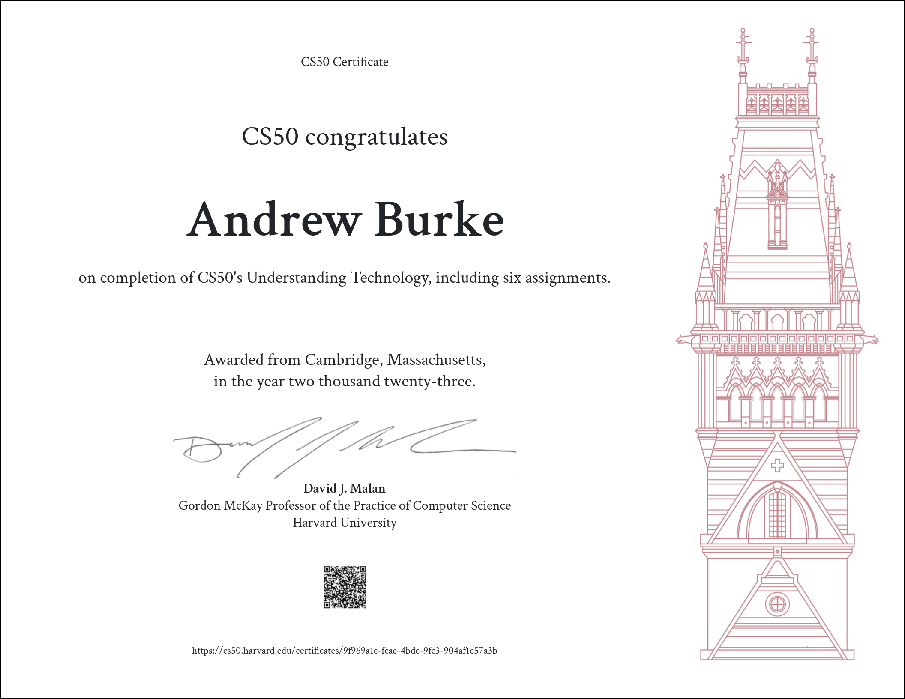

#REVIEW: CS50's Understanding Technology (CS50T)

Among the CS50 family of courses, [CS50x](https://cs50.harvard.edu/x/2023/) is undoubtedly the most popular. But I came across another course of theirs that piqued my interest: [CS50's Understanding Technology](https://cs50.harvard.edu/technology/2017/), AKA CS50T. According to the course website, the course is "[d]esigned for students who work with technology every day but don’t necessarily understand how it all works underneath the hood or how to solve problems when something goes wrong, this course fills in the gaps, empowering students to use and troubleshoot technology more effectively."

  

#### So, what actually is CS50T?

CS50T essentially extracts and expands on all the *conceptual* content from the regular CS50x course, and it leaves nearly all the actual programming behind. There's no C, no SQL, no Python, etc. And while the CS50T website describes it as a "course is for students who don’t (yet) consider themselves computer persons," I think that description sells it a bit short. Although this isn't a course that teaches you how to do anything as simple send an email or stream a movie, it actually does go somewhat in depth into some computer science topics. It just never gets too technical.

The course consists of 6 lecture topics: Hardware (1), Internet (2), Multimedia (3), Security (4), Web Development (5),  and Programming (6). It does teach a little HTML and CSS in Lecture 5, and a little Scratch in Lecture 6. However, it's nothing too difficult or overwhelming. The lectures are taught by David Malan (who teaches the regular CS50 course). If you know who he is, then you already know that he's a great lecturer. Prof. Malan is full of energy and enthusiasm, which make the lectures a joy to watch.

After each lecture, you are tasked to complete an assignment. Most of the assignments consist of answering 10-ish questions on Google Form. Lecture 5 also tasks you to build a really simple webpage using Replit, and in Lecture 6 you'll have to make a simple program in Scratch. Unlike some of the other CS50 courses, these assignments are not auto-graded. They're graded by CS50 staff, so it can take a bit of time for everything to get graded (anywhere from a few days to a few weeks). If you're able to get at least 70% on each assignment, then you are awarded with a certificate.

#### Should you take this course?

This is a good course for someone who is curious about computer science but not interested in actually learning programming/coding. For anyone who has already has general comp sci knowledge (or anyone who has already taken CS50x), then I'm not sure that there's a ton more that can be learned here. And where CS50x will take most people 100 hours or more of work, CS50T can easily be completed in under 25 hours of work. So it's not a huge time commitment.

If your goal is to actually become a good *programmer*, then you will probably want to find another course. I always find Prof. Malan's lectures enjoyable to watch, and this course was no exception. However, I still wouldn't recommend this one to anyone who has more than a casual interest in computer science.
